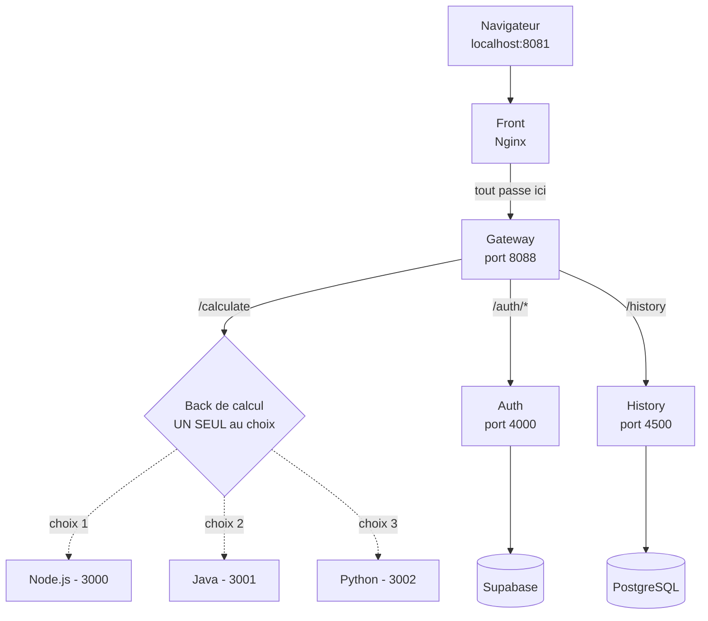
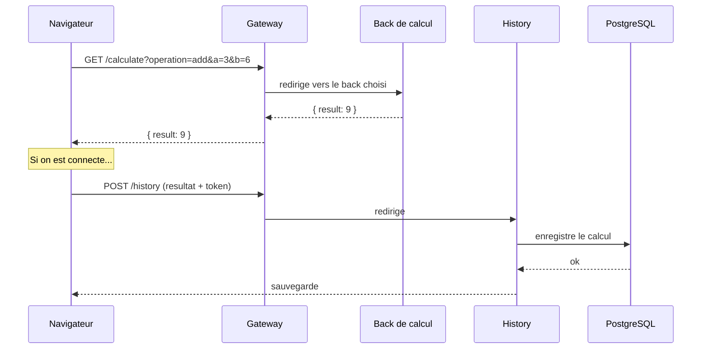
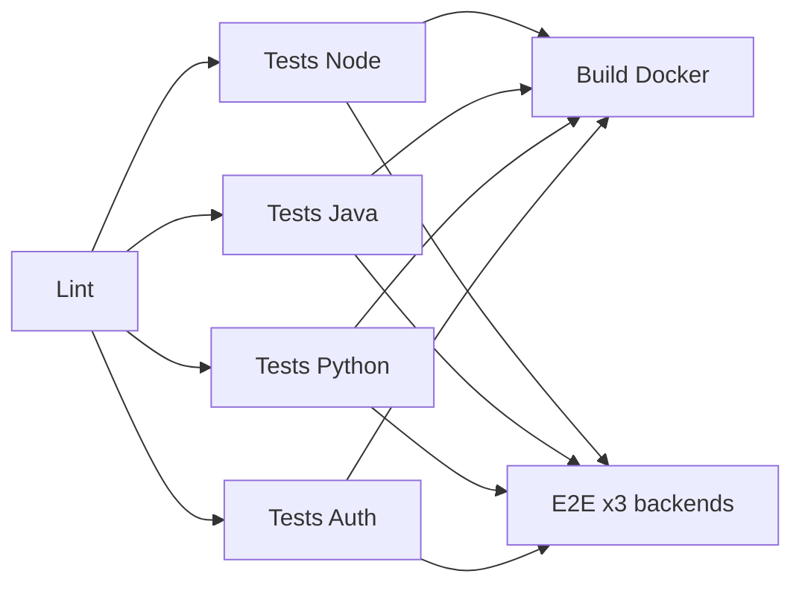
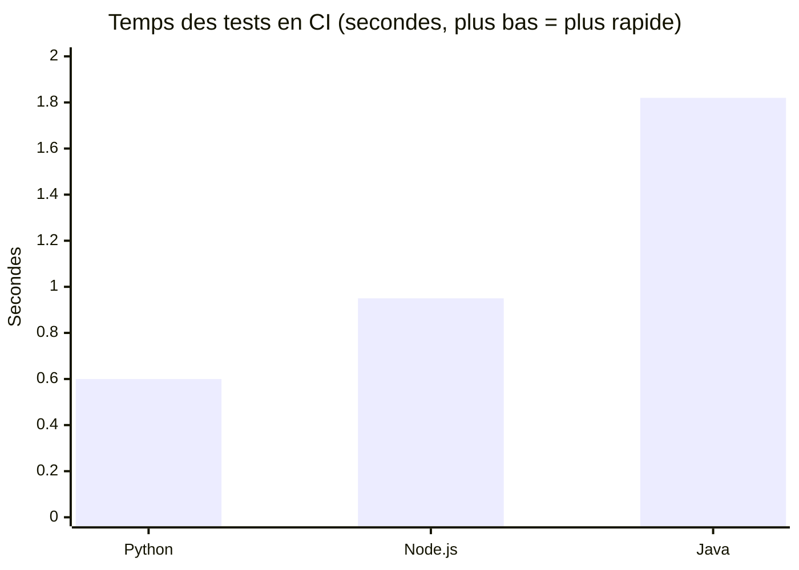

# 🧮 Calculator API — une calculatrice en microservices

Une calculatrice web simple. Mais derrière, le calcul est codé **3 fois**, dans
**3 langages** (Node.js, Java, Python), qu'on peut échanger comme on veut. Le tout
tourne avec **Docker** et est testé tout seul par une **CI GitHub Actions**.

## Développeur Full Stack : Frédéric Makha SAR 
---

## 1. C'est quoi, ce projet ?

À l'écran, c'est une calculatrice. On tape `3 + 6`, on obtient `9`.

Mais derrière le bouton « = », il se passe ça :

1. La page web envoie le calcul à un serveur.
2. Le serveur calcule et renvoie le résultat.
3. Si tu es connecté, le calcul est sauvegardé dans un historique.

Le but du projet n'est pas la calculatrice. Additionner deux nombres, c'est
facile. Le but, c'est d'apprendre à **construire, découper et tester une vraie
application**. C'est un projet sur l'architecture et les tests, déguisé en
calculatrice.

---

## 2. C'est quoi le « mode microservices » ?

Prends l'image d'un restaurant.

- **Sans microservices** : une seule personne prend la commande, cuisine, sert et
  encaisse. Si elle s'arrête, tout s'arrête.
- **Avec microservices** : chaque tâche a sa personne. Un serveur, un cuisinier,
  un caissier. Chacun fait une seule chose. On peut changer le cuisinier sans
  toucher au caissier.

La règle ici : **1 service = 1 rôle**. L'appli est donc coupée en plusieurs petits
programmes séparés qui se parlent par le réseau.

### Les services du projet

| Service             | Dossier                               | Ce qu'il fait                                                      | Techno                  |
| ------------------- | ------------------------------------- | ------------------------------------------------------------------ | ----------------------- |
| **Front**           | `front/`                              | La page web qu'on voit.                                            | HTML / CSS / JS + Nginx |
| **Gateway**         | `gateway/`                            | Le standard téléphonique : reçoit tout et redirige au bon service. | Node.js + Express       |
| **Back de calcul**  | `back/`, `back-java/`, `back-python/` | Fait le calcul. **3 versions au choix.**                           | Node / Java / Python    |
| **Auth**            | `auth-service/`                       | Inscription et connexion.                                          | Node.js + Supabase      |
| **History**         | `history-service/`                    | Sauvegarde et relit l'historique.                                  | Node.js + PostgreSQL    |
| **Base de données** | (image Docker)                        | Garde l'historique.                                                | PostgreSQL 16           |

### Le point clé : 3 backs au choix

Les trois backs font la même chose, avec la même adresse :

```
GET /calculate?operation=add&a=3&b=6   →   {"operation":"add","a":3,"b":6,"result":9}
```

Du coup ils sont interchangeables. C'est toi qui choisis lequel lancer. Ce n'est
pas un système de secours automatique : tu décides. Le choix se fait au démarrage
(voir plus bas).

---

## 3. Le schéma



### Ce qui se passe quand on clique sur « = »



À retenir : la sauvegarde ne dépend pas du back de calcul. Que le calcul vienne de
Node, Java ou Python, c'est toujours le service History qui le range. Chaque
service fait sa part, et c'est tout.

---

## 4. Les langages et outils

| Partie             | Techno                                                                                        |
| ------------------ | --------------------------------------------------------------------------------------------- |
| **Front**          | HTML, CSS, JavaScript (sans framework), servi par **Nginx**                                   |
| **Gateway**        | **Node.js** + **Express** + `http-proxy-middleware`                                           |
| **Back de calcul** | **Node.js** (`http`), **Java 17** (`com.sun.net.httpserver`), **Python 3.12** (`http.server`) |
| **Auth**           | **Node.js** + **Supabase**                                                                    |
| **History**        | **Node.js** + **Express** + **PostgreSQL**                                                    |
| **Tests**          | **Jest** (Node), **JUnit 5** (Java), **pytest** (Python), **Playwright** (bout-en-bout)       |
| **Conteneurs**     | **Docker** + **Docker Compose**                                                               |
| **CI**             | **GitHub Actions**                                                                            |

> 💡 À noter : les 3 backs n'utilisent **aucun framework, aucune dépendance**. Ils
> se servent juste du serveur HTTP déjà fourni par le langage. C'est voulu : on
> voit comment chaque langage gère le même problème à la main. Et ça rend le
> comparatif de la section 7 honnête, car on compare la même chose.

---

## 5. Lancer le projet

### Il te faut
- **Docker** et **Docker Compose**.

### Démarrer avec le back de ton choix

La base (gateway, auth, history, base de données, front) est dans
`docker-compose.yml`. Le back de calcul, lui, n'y est pas. On l'ajoute avec un
fichier à part selon le langage voulu.

```bash
# Back Python (le choix par défaut)
docker compose -f docker-compose.yml -f compose.python.yml up -d --build

# Back Java
docker compose -f docker-compose.yml -f compose.java.yml up -d --build

# Back Node.js
docker compose -f docker-compose.yml -f compose.node.yml up -d --build
```

Puis ouvre **http://localhost:8081**.

> ⚠️ Attention pour arrêter : il faut repasser le même fichier, sinon le back ne
> s'arrête pas.
> ```bash
> docker compose -f docker-compose.yml -f compose.python.yml down
> ```

### Les ports

| Port                 | Service                             |
| -------------------- | ----------------------------------- |
| `8081`               | Front (la page web)                 |
| `8088`               | Gateway (l'entrée)                  |
| `4000`               | Auth                                |
| `4500`               | History                             |
| `3000 / 3001 / 3002` | Back Node / Java / Python (interne) |

---

## 6. Les tests

Chaque service a ses tests. La CI relance tout à chaque `push`.

| Back                    | Outil      | Tests | Commande              |
| ----------------------- | ---------- | ----- | --------------------- |
| Node (`back/`)          | Jest       | 53    | `npm test`            |
| Java (`back-java/`)     | JUnit 5    | 30    | `mvn test`            |
| Python (`back-python/`) | pytest     | 30    | `python -m pytest`    |
| Auth (`auth-service/`)  | Jest       | —     | `npm test`            |
| Bout-en-bout (`e2e/`)   | Playwright | —     | `npx playwright test` |

### La CI (`.github/workflows/ci.yml`)



Les tests E2E tournent **3 fois**, une fois par back. Ça prouve que les 3 backs
sont vraiment interchangeables : la même page et les mêmes tests passent, peu
importe le langage derrière.

---

## 7. ⭐ Comparatif des 3 langages : la vitesse des tests

C'est le point demandé. Le projet code la même chose dans 3 langages. On peut donc
comparer une question simple : **lequel exécute ses tests le plus vite ?**

> ⚙️ Chiffres réels, lus dans les logs de la CI (run du 24/06/2026). Ce sont les
> temps donnés par chaque outil de test (`Time:` de Jest, `passed in` de pytest,
> `Time elapsed` de Surefire). On ne compte que les tests. On ne compte pas le
> téléchargement, l'install ou le build Docker.

| Langage       | Outil            | Tests | Temps des tests |
| ------------- | ---------------- | ----- | --------------- |
| 🟢 **Python**  | pytest           | 30    | **0,60 s**      |
| 🟡 **Node.js** | Jest             | 53    | **0,95 s**      |
| 🔴 **Java**    | JUnit + Surefire | 30    | **1,82 s**      |



### Ce que ça veut dire

- 🟢 **Python : 0,60 s.** Le plus rapide. Il démarre vite et pytest est léger.
- 🟡 **Node.js : 0,95 s.** Juste derrière, alors qu'il a 53 tests (presque le
  double). Jest est un peu plus lourd à lancer.
- 🔴 **Java : 1,82 s.** Le plus lent. Mais le détail des logs est intéressant :

| Tests Java                           | Tests | Temps         |
| ------------------------------------ | ----- | ------------- |
| `CalculatorTest` (juste le calcul)   | 23    | **0,146 s** ⚡ |
| `ServerTest` (lance un vrai serveur) | 7     | **1,675 s** 🐢 |

Donc en Java, le calcul tout seul est ultra-rapide (0,146 s). Ce qui prend du
temps, c'est de démarrer la JVM et un vrai serveur dans les tests. Ce n'est pas le
calcul qui est lent, c'est la mise en route.

> 📝 Maven affiche aussi `Total time: 5,40 s`. Mais ça compte aussi la
> compilation. Ce n'est plus juste les tests, donc on ne le garde pas.

### En clair

Pas de « meilleur langage ». Python et Node démarrent vite, donc ils sont
pratiques quand on relance souvent les tests. Java met plus de temps à se lancer,
mais une fois lancé, son calcul est le plus rapide. Coder la même chose 3 fois
permet de le voir pour de vrai, pas juste en théorie.

---

## 8. Les dossiers

```
calculatorapi-js/
├── front/                 # La page web
├── gateway/               # L'entrée (redirige les requêtes)
├── back/                  # Back de calcul — Node.js
├── back-java/             # Back de calcul — Java 17
├── back-python/           # Back de calcul — Python 3.12
├── auth-service/          # Inscription / connexion
├── history-service/       # Historique (+ PostgreSQL)
├── e2e/                   # Tests bout-en-bout (Playwright)
├── docker-compose.yml     # La base (sans back de calcul)
├── compose.node.yml       # Ajoute le back Node
├── compose.java.yml       # Ajoute le back Java
├── compose.python.yml     # Ajoute le back Python
└── .github/workflows/ci.yml  # La CI
```

---

## 9. En résumé

- Une calculatrice simple à l'écran.
- Une vraie architecture microservices derrière (1 service = 1 rôle).
- Le calcul est codé 3 fois (Node, Java, Python), au choix.
- Tout tourne avec Docker et est testé tout seul par la CI.
- Bonus : un comparatif chiffré de la vitesse des tests entre les 3 langages.
