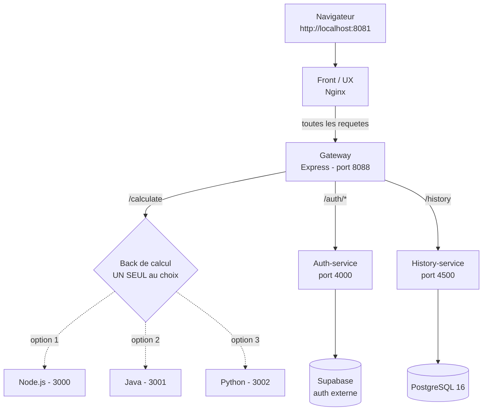
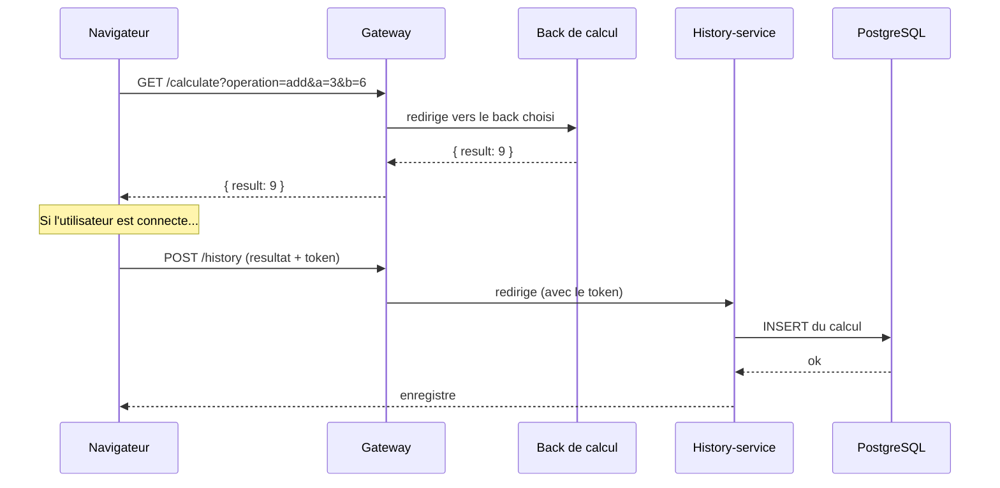
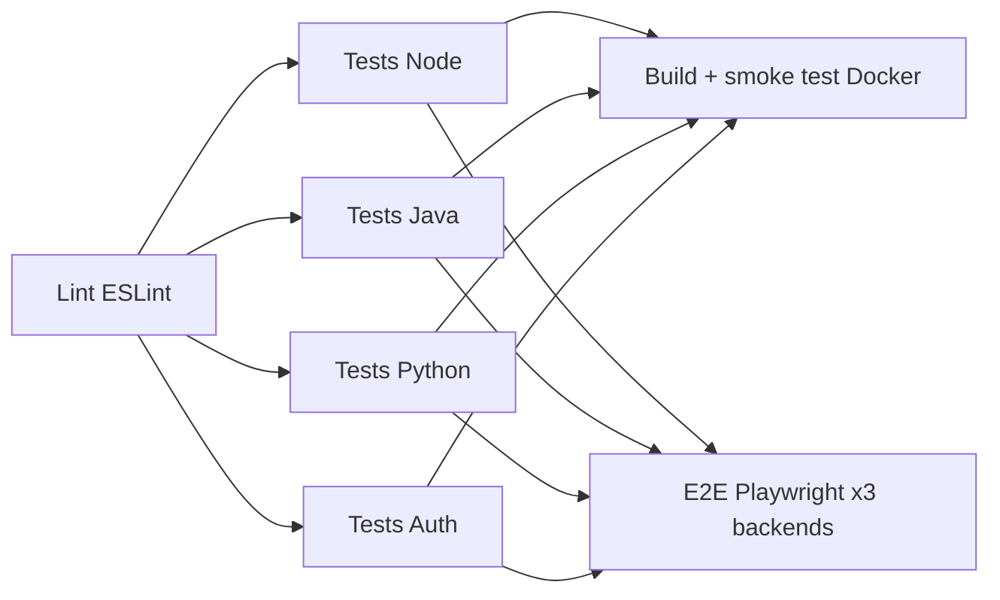
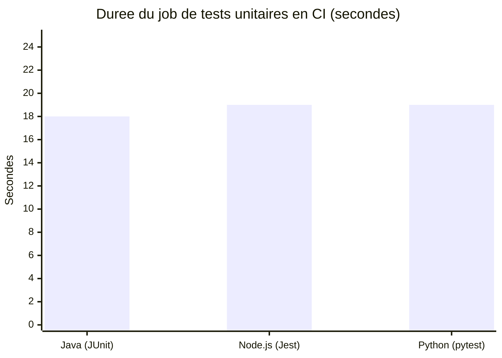
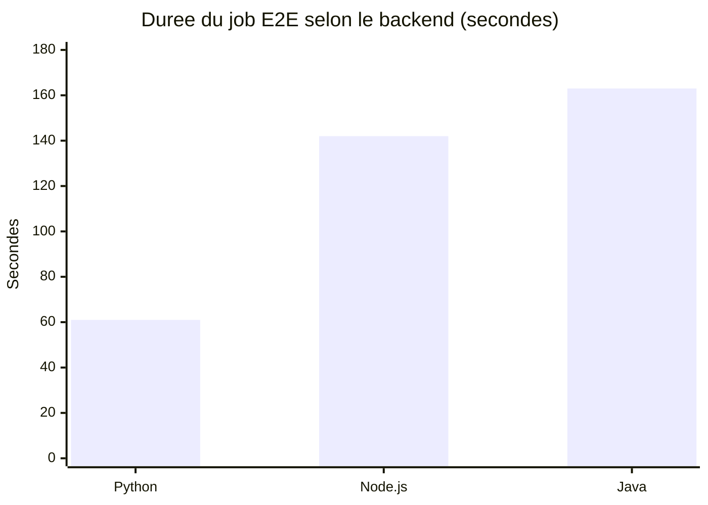

# 🧮 Calculator API — une calculatrice en microservices

> Projet d'atelier Ynov : une **calculatrice web** dont le « cerveau » (le calcul)
> est codé **3 fois, dans 3 langages différents** (Node.js, Java, Python), tous
> interchangeables, le tout orchestré avec **Docker** et testé automatiquement
> par une **CI GitHub Actions**.

Ce README est écrit pour un·e **débutant·e** : on explique chaque brique, pourquoi
elle existe, et comment lancer le projet. Tout à la fin, il y a un **comparatif
chiffré** entre les 3 langages du back sur un point concret du projet.

---

## 1. C'est quoi, ce projet ?

À l'écran, c'est une simple calculatrice : on tape `3 + 6`, on obtient `9`.

Mais derrière ce bouton « = », il se passe beaucoup de choses :

1. La page web envoie le calcul à un **serveur**.
2. Le serveur calcule et renvoie le résultat.
3. Si tu es **connecté**, le calcul est **sauvegardé** dans un historique.

L'intérêt pédagogique du projet n'est PAS la calculatrice elle-même (additionner
deux nombres, c'est facile). L'intérêt, c'est **comment on construit, découpe,
conteneurise et teste une application moderne**. C'est un projet sur
l'**architecture** et les **tests**, déguisé en calculatrice.

---

## 2. C'est quoi le « mode microservices » ?

Imagine un restaurant.

- **Approche monolithe** (classique) : une seule personne prend la commande,
  cuisine, fait le service, encaisse et fait la vaisselle. Si elle tombe malade,
  tout s'arrête.
- **Approche microservices** (ce projet) : chaque tâche a sa propre personne
  spécialisée. Un serveur prend la commande, un cuisinier cuisine, un caissier
  encaisse. Chacun fait **une seule chose, mais bien**. On peut remplacer le
  cuisinier sans toucher au caissier.

Ici, le principe est : **« 1 service = 1 responsabilité »**. L'appli est donc
découpée en **plusieurs petits programmes indépendants** qui communiquent par le
réseau (HTTP).

### Les services du projet

| Service | Dossier | Rôle (en une phrase) | Techno |
|---|---|---|---|
| **Front (UX)** | `front/` | La page web de la calculatrice (ce que tu vois). | HTML / CSS / JS, servi par Nginx |
| **Gateway** | `gateway/` | Le « standard téléphonique » : reçoit toutes les requêtes et les redirige vers le bon service. | Node.js + Express |
| **Back de calcul** | `back/`, `back-java/`, `back-python/` | Fait le calcul. **3 versions interchangeables.** | Node / Java / Python |
| **Auth-service** | `auth-service/` | Gère l'inscription / connexion (via Supabase). | Node.js |
| **History-service** | `history-service/` | Enregistre et relit l'historique des calculs. | Node.js + PostgreSQL |
| **Base de données** | (image Docker) | Stocke l'historique de façon durable. | PostgreSQL 16 |

### Le point clé : 3 backs de calcul interchangeables

Les trois backs (`back/` en Node, `back-java/` en Java, `back-python/` en Python)
exposent **exactement la même API** :

```
GET /calculate?operation=add&a=3&b=6   →   200 {"operation":"add","a":3,"b":6,"result":9}
```

Ils sont donc **strictement interchangeables**. C'est toi qui **choisis lequel
faire tourner** (ce n'est PAS un système de secours automatique : on décide
explicitement quel back lancer). Le choix se fait au démarrage via un fichier
Docker Compose d'« override » — voir la section *Lancer le projet*.

---

## 3. Schéma de l'architecture



### Que se passe-t-il quand on clique sur « = » ?



Point important : **la sauvegarde est indépendante du back de calcul**. Que le
calcul ait été fait par Node, Java ou Python, c'est toujours `history-service`
(+ PostgreSQL) qui le stocke. Chaque service ne s'occupe que de SA tâche.

---

## 4. Les langages et technologies utilisés

| Couche | Technologies |
|---|---|
| **Front** | HTML, CSS, JavaScript « vanilla » (sans framework), servi par **Nginx** |
| **Gateway** | **Node.js** + **Express** + `http-proxy-middleware` + `cors` + `morgan` |
| **Back de calcul** | **Node.js** (module `http`), **Java 17** (`com.sun.net.httpserver`), **Python 3.12** (`http.server`) |
| **Auth** | **Node.js** + **Supabase** (service d'authentification externe, JWT) |
| **Historique** | **Node.js** + **Express** + **PostgreSQL** (`pg`) + `jsonwebtoken` |
| **Tests** | **Jest** (Node), **JUnit 5** (Java), **pytest** (Python), **Playwright** (tests end-to-end) |
| **Conteneurs** | **Docker** + **Docker Compose** |
| **CI/CD** | **GitHub Actions** |

> 💡 **Détail volontaire et intéressant :** les 3 backs de calcul n'utilisent
> **aucun framework web ni aucune dépendance externe**. Chacun se contente du
> **serveur HTTP intégré à son langage**. C'est un choix pédagogique : voir
> comment chaque langage gère « à la main » le même problème (router une URL,
> lire des paramètres, renvoyer du JSON). C'est aussi ce qui rend le comparatif
> de la section 7 honnête : on compare des choses vraiment équivalentes.

---

## 5. Lancer le projet

### Prérequis
- **Docker** et **Docker Compose** installés.

### Démarrer la stack avec le back de ton choix

La base (gateway, auth, history, base de données, front) est dans
`docker-compose.yml`. Le **back de calcul n'y est pas** : on l'ajoute avec un
fichier d'« override » selon le langage voulu.

```bash
# Avec le back Python (le défaut du projet)
docker compose -f docker-compose.yml -f compose.python.yml up -d --build

# Avec le back Java
docker compose -f docker-compose.yml -f compose.java.yml up -d --build

# Avec le back Node.js
docker compose -f docker-compose.yml -f compose.node.yml up -d --build
```

Puis ouvre **http://localhost:8081** 🎉

> ⚠️ **Piège à connaître :** pour **arrêter** la stack, il faut **repasser le
> même override**, sinon le conteneur du back ne sera pas arrêté (la base ne le
> connaît pas) :
> ```bash
> docker compose -f docker-compose.yml -f compose.python.yml down
> ```

### Les ports utilisés

| Port | Service |
|---|---|
| `8081` | Front (la page web) |
| `8088` | Gateway (point d'entrée des requêtes) |
| `4000` | Auth-service |
| `4500` | History-service |
| `3000 / 3001 / 3002` | Back Node / Java / Python (interne) |

---

## 6. Les tests

Chaque service a ses propres tests, et la CI vérifie tout à chaque `push`.

| Back | Outil | Nb de tests | Comment lancer |
|---|---|---|---|
| Node (`back/`) | Jest | **53** | `npm test` |
| Java (`back-java/`) | JUnit 5 | **30** | `mvn test` |
| Python (`back-python/`) | pytest | **30** | `python -m pytest` |
| Auth (`auth-service/`) | Jest | — | `npm test` |
| Bout-en-bout (`e2e/`) | Playwright | — | `npx playwright test` |

### Le pipeline CI (GitHub Actions, `.github/workflows/ci.yml`)



Les tests E2E sont lancés **3 fois** (un job par backend : node, java, python),
ce qui **prouve que les 3 backs sont vraiment interchangeables** : la même page
web et les mêmes scénarios passent quel que soit le langage derrière.

---

## 7. ⭐ Comparatif des 3 langages : la vitesse des tests en CI

C'est le point concret demandé. Le projet implémente **le même back de calcul,
avec la même API, en n'utilisant que la bibliothèque standard de chaque langage**.
On peut donc comparer équitablement : **combien de temps prend chaque langage
dans la CI GitHub Actions ?**

> ⚙️ Chiffres **réels**, relevés sur un run de la CI (`CI — Tests & Couverture`,
> branche `main`, 24/06/2026). Ce sont les **durées des jobs GitHub Actions**,
> mesurées via l'API GitHub. Un job = checkout + installation de
> l'environnement + installation des dépendances + exécution des tests.

### 7.1 — Les jobs de tests unitaires

| Job CI | Langage | Outil | Nb de tests | Durée du job |
|---|---|---|---|---|
| `Tests Java (JUnit)` | 🔴 Java | JUnit + Maven | 30 | **18 s** |
| `Tests Node.js` | 🟡 Node.js | Jest | 53 | **19 s** |
| `Tests Python (pytest)` | 🟢 Python | pytest | 30 | **19 s** |



**Surprise : les trois sont quasi à égalité (~18–19 s).** C'est l'enseignement le
plus intéressant. En local, Java semblait le plus lent (démarrage JVM + Maven).
Mais en CI, le temps est **dominé par le « décor » commun** à tous les jobs —
cloner le dépôt, installer Java/Node/Python, télécharger les dépendances — pas par
le calcul des tests lui-même. L'exécution réelle des tests (quelques centaines de
millisecondes) est **noyée** dans ce temps de préparation. Conclusion : sur de
petits projets, **le choix du langage ne change presque rien** au temps de CI.

### 7.2 — Là où le langage fait vraiment la différence : les jobs E2E

La CI lance aussi les tests bout-en-bout (Playwright) **une fois par backend**.
Chaque job doit **construire l'image Docker du back** puis démarrer toute la stack.
Et là, l'écart entre langages devient net :

| Job CI | Backend testé | Durée du job |
|---|---|---|
| `E2E Playwright (back = python)` | 🟢 Python | **61 s** |
| `E2E Playwright (back = node)` | 🟡 Node.js | **142 s** |
| `E2E Playwright (back = java)` | 🔴 Java | **163 s** |



**Ici Python écrase la concurrence (2,5× plus rapide que Java).** La raison n'est
pas l'exécution des tests (ce sont les mêmes scénarios Playwright), mais la
**construction de l'image Docker du backend** :

- 🟢 **Python** : pas de compilation, image légère → build le plus rapide.
- 🟡 **Node.js** : `npm install` à faire dans l'image → un peu plus lourd.
- 🔴 **Java** : il faut **compiler le code avec Maven** et télécharger ses
  dépendances dans l'image → c'est le plus long à préparer.

### La leçon à retenir

| Question | Réponse mesurée en CI |
|---|---|
| Le langage change-t-il le temps des **tests unitaires** ? | Quasiment pas (~18–19 s pour tous) : le setup du runner domine. |
| Le langage change-t-il le temps du **build + E2E** ? | Beaucoup : Python 61 s, Node 142 s, Java 163 s. |
| Pourquoi Java est-il le plus lent en E2E ? | Compilation Maven + dépendances à construire dans l'image Docker. |
| Pourquoi Python est-il le plus rapide en E2E ? | Langage interprété : aucune étape de compilation, image plus légère. |

👉 **Conclusion :** il n'y a pas de « meilleur langage » dans l'absolu. Sur ce
projet, le langage **ne pèse pas sur le temps des tests unitaires** (le décor de
la CI domine), mais il pèse **fortement sur le temps de build Docker** : le
**Python interprété démarre vite** quand le **Java compilé paie un coût de
construction** (qui, en contrepartie, donne du code plus rapide à l'exécution).
Coder la *même* chose trois fois permet de **mesurer** ce compromis au lieu de le
lire dans un cours.

---

## 8. Arborescence du projet

```
calculatorapi-js/
├── front/                 # La page web (HTML/CSS/JS + Nginx)
├── gateway/               # Le standard téléphonique (Express)
├── back/                  # Back de calcul — Node.js
├── back-java/             # Back de calcul — Java 17 (Maven)
├── back-python/           # Back de calcul — Python 3.12
├── auth-service/          # Inscription / connexion (Supabase)
├── history-service/       # Historique des calculs (+ PostgreSQL)
├── e2e/                   # Tests bout-en-bout (Playwright)
├── docker-compose.yml     # Stack de base (sans back de calcul)
├── compose.node.yml       # Override : ajoute le back Node
├── compose.java.yml       # Override : ajoute le back Java
├── compose.python.yml     # Override : ajoute le back Python
└── .github/workflows/ci.yml  # Pipeline CI (lint + tests + Docker + E2E)
```

---

## 9. En résumé

- Une **calculatrice web** simple en façade…
- …mais une vraie **architecture microservices** derrière (« 1 service = 1 rôle »).
- Le **cœur de calcul est écrit 3 fois** (Node, Java, Python), tous
  interchangeables, ce qui permet de **comparer les langages** sur un même
  terrain.
- Tout est **conteneurisé** (Docker) et **testé automatiquement** (CI :
  lint, tests unitaires des 3 langages, build Docker, E2E sur les 3 backends).
- Bonus pédagogique : un **comparatif chiffré** de la vitesse des tests qui
  montre concrètement les compromis Python vs Node vs Java.
